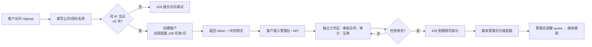

# ANENGOS 客户自助开通流程设计

> 版本：v1.0 ｜ 2026-10-09 ｜ 状态：已实现（`POST /api/signup` + `signup.html`）

## 1. 目标

让客户**零人工介入**地获得试用租户：访问注册页 → 填公司名 → 立即拿到 token → 开始使用。管理员只负责"升级套餐 / 停用"，不负责开户。

## 2. 流程总览



## 3. 已实现的能力（本轮代码）

| 能力 | 实现 | 端点 / 文件 |
|---|---|---|
| 公开注册（免鉴权） | 创建租户 + 试用配额 + 一次性 token | `POST /api/signup` |
| 注册页 | 深色简洁表单，前端校验 + 错误提示 | `signup.html`（`GET /signup`） |
| 防滥用限流 | 同一 IP 每日最多 5 个租户（内存） | `_SIGNUP_LIMIT` / `_signup_rate_limited` |
| 默认试用配额 | `tasks_per_month:100, agents:1, storage_mb:100` | `DEFAULT_QUOTA` |
| 用量计数 | 每次任务提交 +1，月度 UTC 滚动重置 | `_bump_usage` / `_tenant_record` |
| 配额强制 | 超配额 `POST /run`、`run-async` 返回 429 | `_quota_error` |
| 用量查看 | 管理台用量面板 / `GET /admin/api/usage` | 租户看自己，管理员看全部 |
| 配额调整 | 管理员 `POST /admin/api/tenants/{id}/quota` | 升级套餐通道 |

## 4. 数据模型

```json
{
  "tenant_id": "a1b2c3d4",
  "name": "泉州测试客户",
  "token_hash": "sha256(...)",
  "status": "active",
  "created_at": "2026-10-09T00:00:00+00:00",
  "quota": { "tasks_per_month": 100, "agents": 1, "storage_mb": 100 },
  "usage": { "tasks": 12, "month": "2026-10" }
}
```

## 5. 升级路径（付费转化）

| 阶段 | 触发 | 动作 |
|---|---|---|
| 试用 → 团队版 | 客户联系 / 用量接近上限 | 管理员调 `quota`（¥299/月） |
| 团队版 → 企业 SaaS | 需多租户 / 审计导出 | 调配额 + 开通审计导出 |
| SaaS → 私有化 | 数据敏感 / 合规要求 | 走报价单，交付镜像 |

> 计费闭环的下一步（未实现，建议迭代）：用量记录导出 CSV、账单周期对齐自然月、自动限速（非硬停）、Webhook 通知管理员。

## 6. 安全与边界

- 注册页只创建**试用租户**，不开放模型 key 配置（BYOK 由管理员配置全局 key）
- token 仅明文返回一次，丢失需管理员重置（当前为重建租户，建议后续加 `POST /admin/api/tenants/{id}/reset-token`）
- 限流在内存中，容器重启清零——多实例部署时应移到 Redis（单机部署无此问题）
- 生产环境建议 Nginx 限制 `/signup` 频率或仅开放给指定来源

## 7. 验收标准（已通过）

- [x] 注册页可达、可提交、错误提示清晰
- [x] 注册成功返回 token，租户出现在管理台「客户账号」与「用量」面板
- [x] 超配额 429，月度重置后恢复
- [x] 同一 IP 超限 429
- [x] 非管理员不能改配额
